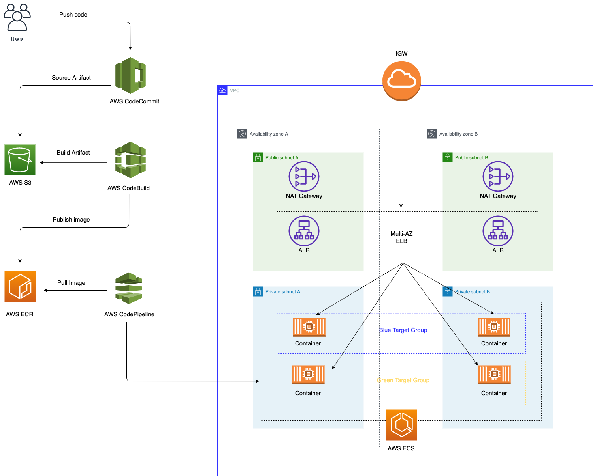
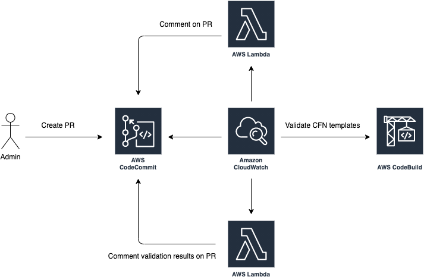

# AWS ECS Blue/Green Deployment on Elasitc Container Service

## Overview
This architecture have 2 parts:
- Initializing infrastructure for devops tasks allow developer can update infrastructure with only actions push code, create pull request and merge pull request.
- Initializing infrastructure for continuous delivery by leveraging AWS CloudFormation templates. The templates create AWS resources to build and deploy container onto an ECS cluster as long running services. It also includes a manual approval step and swap target group rule betwwen 2 target group promoting the green version to production and demoting the blue version to staging.

Read more about [blue-green deployment](https://en.wikipedia.org/wiki/Blue-green_deployment)

## Detail

### Infrastructure
The architecture is designed to make sure any create/update is reviewd and approved by admin, don't have any way to force update without approval from admin.

With the repository `cfn-infra`, the code infrastructure implements:
- IAM permissions for each user role, each role have different permissions with AWS resources
- CodeBuild for validation CloudFormation templates and CodePipeline for approve/execution changes
- Send notifications to email after CodeBuild finish process

With the repository `cfn-service`, the code infrastructure implements:
- VPC environment
- ECS cluster and ECS service for running api service
- CodeBuild and CodePipeline for build image and execution list of steps for blue/green deployment



With the repository `api`, it contains source for api service

### Implementation

#### Create/update service infrastructure

When developer want to create/update any infrastructure for service in repository `cfn-service`, list of steps are followed:



1. Developer checkout new branch for create/update and push code to it
2. Developer create pull request above feature to develop branch
3. The system auto comment on pull request with message start CodeBuild for validation CloudFormation templates
4. After finishing validation templates, the CodeBuild will comment on pull request with validation results


5. Admin check comment and approve/reject pull request
6. After admin approve the pull request, the code change is merge to develop. The code is pushed to S3 bucket and run pipeline for apply new change

#### Update service api
When developer want to update api version, code is merge to develop and run the pipeline for apply new change

Here is further explaination for each stages of Code Pipeline.

**During Build stage**

* During first phase, CodeBuild builds the docker container image and pushes to AWS ECR.

* During second phase, Codebuild executes `scripts/deploy.py` which executes the following scripted logic:
  1. Retrieve artifact `build.json` from the previous phase (CodeBuild phase)
  2. Check if the load balancer exists
  3. Get tag key value of the target group, running on port 8080 and 80 with KeyName as "Identifier". It will be either "Code1" or "Code2"
  4. Get Sha of the image id running on target group at port 8080 and 80
  5. Edit the build.json retrieved from step1 and append the values retrieved in step3 and step4
  6. Save the modified build.json. This file is the output from codebuild project and fed as an input to the CloudFormation execution stage.This json file follow by format
    ```
      {
        "Code1" : "CONTAINER_TAG1",
        "Code2" : "CONTAINER_TAG2"
      }
    ```
  If the load balancer does not exists (as found in step-2), this would imply that the stack is executed for the first time, and the values of "CONTAINER_TAG1" and CONTAINER_TAG2" will be the same and default to the
  value retrieved from build.json in step-1

**During Deploy stage**
CodePipeline executes `templates/ecs-cluster.yml`. The CloudFormation input parameters with KeyName as "Code1" and "Code2" are overwritten with the values as written in the build.json, retrieved from the second phase of Build Stage.

**During Review stage**
The pipeline offers manual "Review" button so that admin can review code and approve new change.
Providing approvals at this stage will trigger the Lambda function which swaps the Green Target Group to Live traffic. The lambda has the following logic scripted:
  1. Read Job Data from input json
  2. Read Job ID from input json
  3. Get parameters from input json
  4. Get Load balancer name from parameters
  5. Identify the TargetGroup running on this Load Balancer at port 80 and port 8080. Perform the TargetGroup Swap. Also swap the values of "IsProduction" tags.
  6. Send success or failure to CodePipeline

## AWS Resources
- [AWS CloudFormation](https://aws.amazon.com/cloudformation/)
- [Amazon S3 Bucket](https://aws.amazon.com/s3/)
- [Amazon CodeCommit](https://aws.amazon.com/codecommit/)
- [Amazon ECR](https://aws.amazon.com/ecr/)
- [Amazon SNS](https://aws.amazon.com/sns/)
- [AWS IAM](https://aws.amazon.com/iam/)
- [AWS VPC](https://aws.amazon.com/vpc/)
- [AWS Security Group](https://aws.amazon.com/ec2/)
- [AWS CodePipeline](https://aws.amazon.com/codepipeline/)
- [AWS CodeBuild](https://aws.amazon.com/codebuild/)
- [AWS Lambda](https://aws.amazon.com/lambda/)
- [Amazon ECS Cluster](https://aws.amazon.com/ecs/)
- [Amazon ECS Service](https://aws.amazon.com/ecs/)
- [Application Load Balancer](https://aws.amazon.com/elasticloadbalancing/applicationloadbalancer/)
- [Application Load Balancer Target Groups](https://aws.amazon.com/elasticloadbalancing/applicationloadbalancer/)

## Pre-Requisites
This example uses [AWS Command Line Interface](http://docs.aws.amazon.com/cli/latest/userguide/cli-chap-welcome.html) to run the steps below.

Please follow [instructions](http://docs.aws.amazon.com/cli/latest/userguide/installing.html) if you haven't installed AWS CLI. Your CLI [configuration](http://docs.aws.amazon.com/cli/latest/userguide/cli-chap-getting-started.html) need PowerUserAccess and IAMFullAccess [IAM policies](http://docs.aws.amazon.com/IAM/latest/UserGuide/access_policies.html) associated with your credentials.

Verify that your AWS CLI is installed and up to date.
```
aws --version
```

## Setup

### 1. Clone all source code

Clone repository
```
git clone git@gitlab.asoft-python.com:g-minhtran/aws-training.git
```

Move to directory
```
cd aws-training
```

### 2. Update configurations

Update your configurations in `.activate.sh` file
```
export DEFAULT_EMAIL="<YOUR_EMAIL>"
export DEFAULT_ACCOUNT_NUMBER="<YOUR_DEFAULT_ACCOUNT_NUMBER>"
export DEFAULT_REGION="<YOUR_DEFAULT_REGION>"
```

Run command to load all helper scripts
```
source .activate.sh
```

### 3. Initialize dependencies
```
_init_dependencies
```

### 4. Deploy infrastructure cloudformation stack
```
cfn-create-stack-infra
```

## Initialize source code with new CodeCommit repository

After CloudFormation `spectre-infra` stack finished, get codecommit ssh url and clone repository `cfn-service` from output of stack

### 1. Clone repository for service infrastructure
Move `cfn-service` directory
```
cd cfn-service
```

Clone repository
```
git clone ssh://git-codecommit.<YOUR_REGION>.amazonaws.com/v1/repos/spectre-service
```

Add remote
```
git remote add codecommit ssh://git-codecommit.<YOUR_REGION>.amazonaws.com/v1/repos/spectre-service
```

After that, create master and develop branch

### 2. Clone repository for service api source

Move `api` directory
```
cd api
```

Clone repository
```
git clone ssh://git-codecommit.<YOUR_REGION>.amazonaws.com/v1/repos/api
```

Add remote
```
git remote add codecommit ssh://git-codecommit.<YOUR_REGION>.amazonaws.com/v1/repos/api
```

After that, create master and develop branch

***Note: All above commands run with admin permissions.***


## Cleaning up

Delete infrastructure stack
```
spectre-cfn-delete-infra
```

Delete service stack
```
spectre-cfn-delete-service
```

Delete ecs cluster
```
spectre-cfn-delete-ecs-cluster
```
